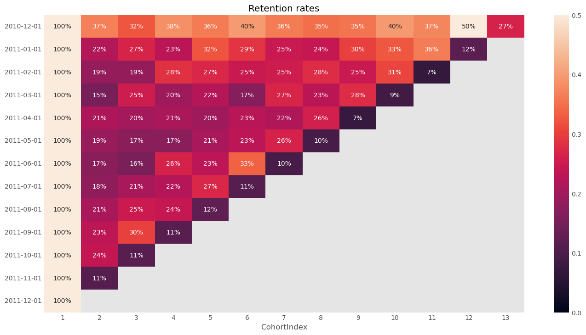
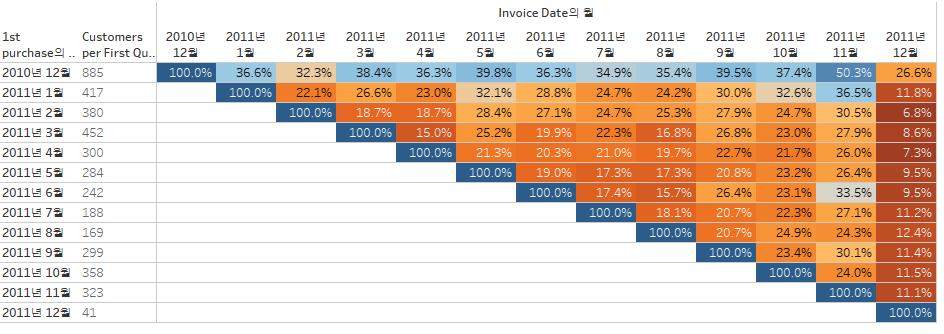
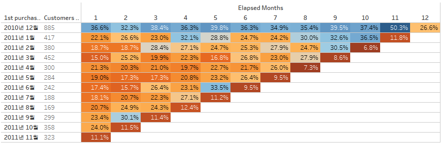

# Cohort-Analysis

## 목표 : Cohort 분석에 대한 이해
- 세부 목표
1. Kaggle 데이터 셋과 Code를 필사하며 Cohort 분석에 대한 이해
2. SQL을 활용한 Cohort 분석 방법 확인
3. Tableau를 활용한 시각화
  

- 필사 학습 내용
1. 코호트는 넓은 의미에서 공통적인 특성을 가진 사람들의 집단을 뜻하며, 해당 데이터와 필사 코드에서는 같은 첫 구매 시기(1개월 단위)를 가진 유저의 그룹으로 코호트를 정의.

2. 위와 같이 특정 기간을 중심으로 코호트를 구성하는 경우에는 서비스에 대한 첫 인상과 UX가 변하면서 생기는 리텐션의 변화를 확인하는데 유용한데, 이 데이터만으로는 커버하기 어려운 범위였음.  
서비스에 대한 정보나 추가적인 사용자 데이터가 있으면 더 좋았을 것.

3. 2010년 12월 첫 구매를 한 코호트의 리텐션이 전체적으로 높은 수치를 보임

4. 2010년 12월 첫 구매를 한 코호트의 12번째 index에서 retention이 50%까지 상승 
1년 단위의 계절성이 있는지 확인해보고 싶으나, 이외의 다른 코호트의 index가 12이하로 확인이 어려웠음.

5. RFM을 기준으로 한 User Segmentation 방법 확인.

 

- Tableau 학습 내용
1. 위의 두가지 방법으로 시각화가 가능.

2. 첫 번째 그래프의 경우 월별로 유저 Retention을 확인하기에 용이하고, 두 번째 그래프의 경우 유저의 첫 구매 후 지난 기간에 따른 Retention을 확인하기에 용이.

3. 해당 데이터에서는 Retention이 높은 값과 낮은 값이 모두 눈에 띄어야 한다고 생각하여 Retention이 높은 경우 진한 파란색, 낮은 경우 진한 주황색으로 표현. 

- Tableau : https://public.tableau.com/app/profile/jiho3438/viz/Cohort_analysis_16868437469070/Cohort_analysis_ver1image.png